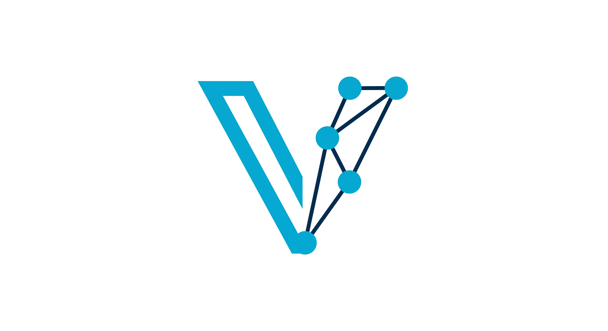

[](https://claude.ai/code)

<p align="center">
  
</p>

<h1 align="center">VisorRAG</h1>
<p align="center"><em>Agentic recon driven by a RAG-grounded LLM · every probe sandboxed in gVisor</em></p>

---

## What it is

VisorRAG is an LLM-driven security reconnaissance agent that closes the loop between discovery and memory. The core loop is **Retrieve → Think → Act → Observe**: before each LLM turn, a RAG engine pulls the top-scoring playbook chunk per source (web, cloud, API, AI/ML) and the last 6 confirmed findings for the exact target — so the model reasons over empirical ground truth, not stale assumptions. Tool observations are embedded and persisted between runs, which means a second scan doesn't restart from scratch. The agent sees what it already confirmed, skips redundant probes, and looks for drift.

Every probe runs inside a gVisor OCI bundle: readonly rootfs, a single capability (CAP\_NET\_RAW for raw sockets), explicit namespace isolation, and a 512 MB memory ceiling. The agent process — which holds API keys, decision state, and the full RAG memory — never shares a process boundary with probe execution. This isn't container-level isolation; gVisor intercepts syscalls directly, so even a compromised probe binary can't reach the host.

The tool set is intentionally narrow and NuClide-authored. VisorGraph maps infrastructure provenance in a single pass (CT logs, HTTP, TLS, exposure classification). aimap fingerprints 36 AI/ML services — Ollama, vLLM, ChromaDB, Qdrant, MLflow — against the exact ports where they actually run. menlohunt does GCP-specific surface work: cert SAN extraction for project ID leaks, metadata API, GCS discovery. BARE takes any finding and semantic-searches 3,904 Metasploit modules to rank exploit relevance. Nuclei and osv-scanner register conditionally when their dependencies are present. Commodity scanners (httpx, naabu, asnmap) are defined but not in the default registry — seven live runs showed they hit auth walls, missing template directories, and preset rejections that the purpose-built tools sidestep by design.

The system prompt enforces tool discipline explicitly: the LLM is told that playbook text may reference tools that are not in its function-calling spec, and it may never fabricate a call for a name it only saw in markdown. Schema type inference (number vs string) makes the same tool definitions work across strict providers like Groq without manual schema adjustment. `--manual` mode gates every invocation through an interactive y/n prompt; a rejection becomes a negation the model sees and routes around. `--cortex` adds a post-recon pass that drafts a formal authorization-context artifact against the observed attack surface.

---

## Architecture

```
visor CLI
  └── agent (ReAct loop, Anthropic / OpenAI)
        ├── rag (chromem-go)
        │     ├── playbooks/  — embedded markdown (ai-ml, api, cloud, web)
        │     └── findings/   — persistent observations, namespaced by embedder
        ├── tools
        │     ├── visorgraph  — seed-polymorphic recon graph
        │     └── aimap       — 36-service AI/ML fingerprinter
        └── sandbox (gVisor runsc)
              └── every tool call runs in an OCI bundle
```

---

## Requirements

- Go 1.22+
- [gVisor](https://gvisor.dev/docs/user_guide/install/) (`runsc` in `$PATH`)
- `ANTHROPIC_API_KEY` **or** `OPENAI_API_KEY`
- `visorgraph` and/or `aimap` binaries in `$PATH`

Embedding backend (first match wins):

| Priority | Condition | Backend |
|---|---|---|
| 1 | `VISORRAG_EMBED=ollama` | Ollama at `$OLLAMA_HOST` |
| 2 | `VISORRAG_EMBED=openai` | OpenAI `text-embedding-3-small` |
| 3 | `OPENAI_API_KEY` set | OpenAI `text-embedding-3-small` |
| 4 | fallback | Ollama `nomic-embed-text` at localhost:11434 |

---

## Install

```bash
git clone https://github.com/Nicholas-Kloster/VisorRAG
cd VisorRAG
go build -o visor ./cmd/visor
```

---

## Usage

```bash
# Basic run — agent decides steps automatically
visor --target 192.0.2.1

# Cap the ReAct loop
visor --target example.com --max-steps 8

# Override the model
visor --target 10.0.0.0/24 --model claude-opus-4-7

# Ephemeral run — no findings written to disk
visor --target 192.0.2.1 --ephemeral

# Manual step confirmation
visor --target 192.0.2.1 --manual

# Keep state between sessions
visor --target 192.0.2.1 --state-dir ~/.visor/sessions/target-1
```

---

## Playbooks

Markdown documents embedded at build time and loaded into the RAG index on startup. The agent retrieves relevant chunks before each ReAct step.

| Playbook | Coverage |
|---|---|
| `ai-ml.md` | AI/ML infrastructure discovery, vector DBs, inference endpoints |
| `api.md` | API reconnaissance, auth bypass, key enumeration |
| `cloud.md` | Cloud asset enumeration, bucket discovery, metadata endpoints |
| `web.md` | Web recon, header analysis, JS secrets, redirect chains |

---

## Related

- **[VisorGraph](https://github.com/Nicholas-Kloster/VisorGraph)** — seed-polymorphic recon graph engine (used as default tool)
- **[aimap](https://github.com/Nicholas-Kloster/aimap)** — AI/ML infrastructure deep enumerator (used as default tool)
- **[JAXEN](https://github.com/Nicholas-Kloster/JAXEN)** — Shodan-powered recon platform, feeds targets into VisorRAG
- **[BARE](https://github.com/Nicholas-Kloster/BARE)** — semantic exploit matching against Metasploit corpus

---

## License

MIT
